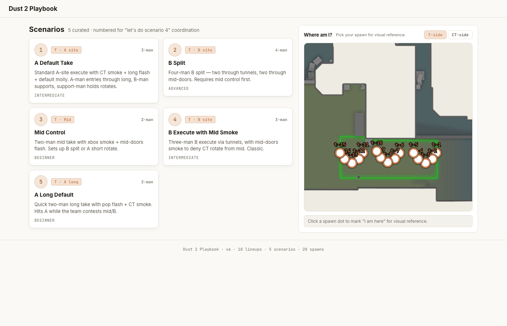
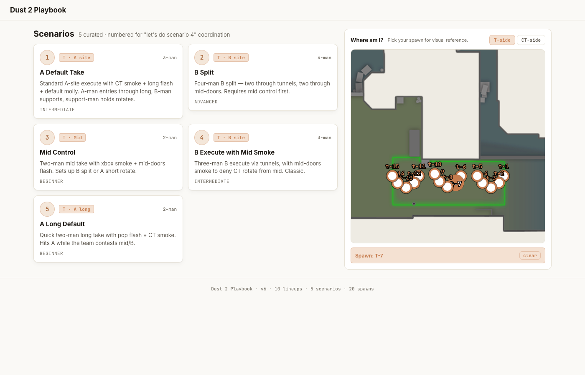
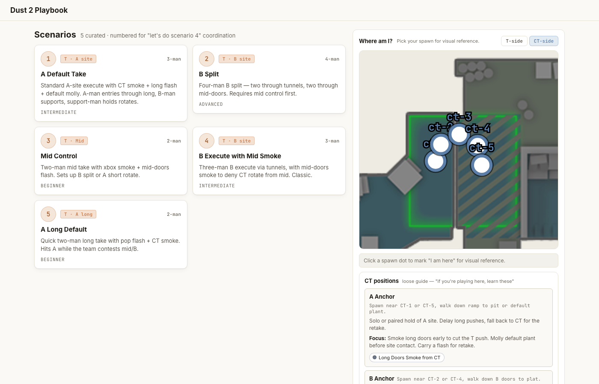
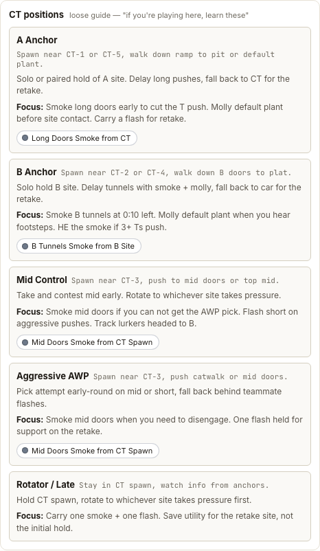
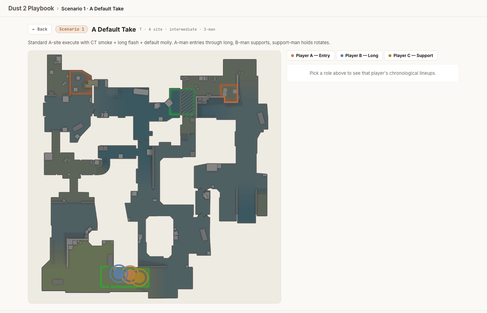
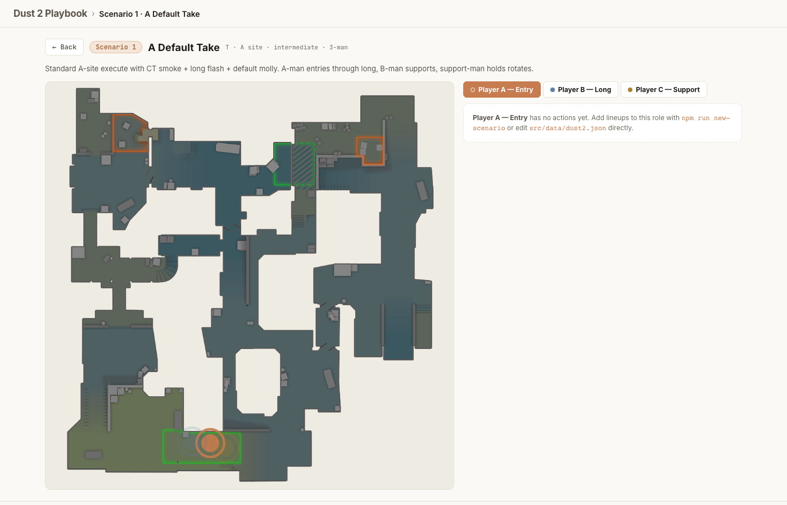
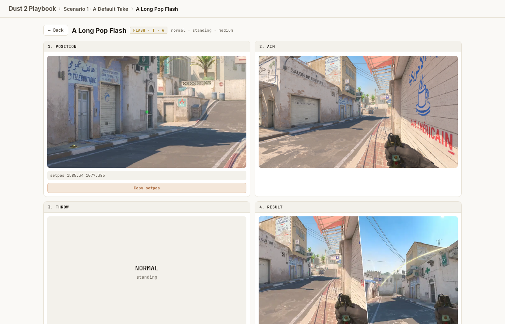

# Dust 2 Playbook — User Guide

How to use the app on a Discord call, and how to add new lineups + scenarios.

---

## 1. The home page

When you load the app, this is what you see:



**Left:** the curated scenario grid. Five seeded shells today (numbered 1–5). When you author actions for each, they fill in.

**Right:** the "Where am I?" spawn picker. Click `T-side` / `CT-side` to swap clusters. Click a dot to highlight it as your current spawn — useful as a visual anchor while you read scenario cards.

### Spawn picker — picked state

After clicking a dot:



The picked dot turns solid; the chip below changes from instruction to **Spawn: S6** with a clear button. This is purely a visual reference — it doesn't filter scenarios.

### Spawn picker — CT side + position guide



CT side has 5 spawns labelled `ct-1`..`ct-5` (T side labels are `t-1`..`t-15`). The side prefix exists so there's no miscommunication on voice — saying "ct-3" is unambiguous, while "spawn 3" is not.

Below the picker on CT side, you'll see the **CT positions** panel:



Five common CT roles with:
- **Spawn hint** — where to start and which way to walk.
- **Description** — one or two sentences on the role.
- **Focus** — what utility to carry and when.
- **Clickable lineup chips** — links straight to the 4-card walkthrough for the recommended utility.

This is a loose guide, not a strict prescription. Pick a role on a call ("I'll anchor B"), check the position card, learn the recommended lineups over time. The list grows as you author more CT-side lineups.

### Editing the CT position guide

CT positions live in `src/data/dust2.json` under the `ctPositions` array. Add or edit them directly:

```json
"ctPositions": [
  {
    "id": "a-anchor",
    "label": "A Anchor",
    "description": "Solo or paired hold of A site.",
    "spawnHint": "Spawn near CT-1 or CT-5, walk down ramp.",
    "recommendedLineupIds": ["ct_long_doors_smoke"],
    "utilityFocus": "Smoke long early. Molly default. Flash for retake."
  }
]
```

The boot validator rejects any `recommendedLineupIds` that doesn't match an existing lineup — same ref-integrity rule as scenario actions.

---

## 2. Running a scenario on a call

The headline workflow. You're on Discord with friends; you say *"let's do scenario 4, I'm A-man."* Here's what each person does:

### Step 1 — Click the scenario card

Each card shows the number, side, target area, player count, brief description, and difficulty. The number is the stable identifier you call out on voice — "scenario 4" always sits in the same slot regardless of how the list scrolls.

### Step 2 — The scenario detail opens



You see the radar with all players' arcs drawn, color-coded by role. The role tabs along the top of the right column are your call-out buttons.

### Step 3 — Pick your role



Click *Player A — Entry* (or B, or Support, depending on your call). The radar dims every other role's arcs to 18% opacity so only your arcs stand out. The right column lists your actions in chronological order, with timing notes ("t+5s") and description hints.

The same scenario from the B-man's perspective shows only the B-man's arcs and lineup sequence — every player on the call is looking at their own focused view, but they're inside the same scenario.

### Step 4 — Click your first action

Each action row dispatches into the 2×2 walkthrough:



Four cards, all visible at once, chronological top-left to bottom-right:

1. **Position** — where to stand. Setpos string below the screenshot; click **Copy setpos** to put it on your clipboard.
2. **Aim** — what to look at (crosshair alignment).
3. **Throw** — throw mechanics (jump / run / normal) + setang. If the lineup has a `throw` screenshot, it shows here; if not, you get a text fallback with the throw style + setang values.
4. **Result** — where the utility lands.

Press `Esc` or click the breadcrumb to back out.

---

## 3. Adding a new lineup

You have two ways to add a lineup: the CLI or direct JSON edit. **Use the CLI for single entries pasted from the in-game console.** Use direct JSON edit for batch additions or unusual fields.

### Option A — `npm run new-lineup` (recommended)

In your terminal, from the repo root:

```bash
npm run new-lineup -- --help
```

That prints the flag list. A full invocation looks like this:

```bash
npm run new-lineup -- \
  --id b_double_pop_flash \
  --name "B Double Pop Flash" \
  --type flash --side T --area B \
  --style normal --movement standing --difficulty medium \
  --throw "setpos -1729.4 1064.0 64;setang -3 90 0" \
  --landing "setpos -1300 1500 64" \
  --description 'Two flashes thrown at once for a B exec — covers both window and tunnels exits.' \
  --source-name "BLAST.tv" --source-url "https://blast.tv/article/cs2-dust2-flashes"
```

The CLI validates every flag before touching the JSON. Invalid enum values (e.g., `--type foo`) are rejected with a clear error and exit code 1. The `--id` is case-sensitive and must match `^[a-z][a-z0-9_]*$` (lowercase snake_case). Duplicate ids are rejected.

On success it appends the entry to `src/data/dust2.json` and prints the diff.

### Option B — edit `src/data/dust2.json` directly

Open the file. The `lineups` array is at the top level. Append a new object:

```json
{
  "id": "b_double_pop_flash",
  "name": "B Double Pop Flash",
  "type": "flash",
  "side": "T",
  "area": "B",
  "throwFrom": { "world": { "x": -1729.4, "y": 1064.0, "z": 64 } },
  "landingAt": { "world": { "x": -1300, "y": 1500, "z": 64 } },
  "throwAngle": { "pitch": -3, "yaw": 90, "roll": 0 },
  "throwStyle": "normal",
  "movement": "standing",
  "difficulty": "medium",
  "description": "Two flashes thrown at once for a B exec.",
  "source": { "name": "BLAST.tv", "url": "https://blast.tv/article/cs2-dust2-flashes" }
}
```

The boot validator (`src/data/loadDust2.ts`) will reject the file on load if:
- The `id` is missing or non-string.
- Both `landingAt.world` and `landingAt.percent` are missing.
- Any scenario action references this `id` after you rename or delete it (dangling ref check).

### Add the screenshots

Save your screenshots to:

```
public/screenshots/dust2/<lineup_id>/{position,aim,throw,result}.webp
```

Example for the lineup above:

```
public/screenshots/dust2/b_double_pop_flash/position.webp
public/screenshots/dust2/b_double_pop_flash/aim.webp
public/screenshots/dust2/b_double_pop_flash/throw.webp   (optional)
public/screenshots/dust2/b_double_pop_flash/result.webp
```

Then add them to the lineup's `screenshots` object in the JSON:

```json
"screenshots": {
  "position": "/screenshots/dust2/b_double_pop_flash/position.webp",
  "aim": "/screenshots/dust2/b_double_pop_flash/aim.webp",
  "throw": "/screenshots/dust2/b_double_pop_flash/throw.webp",
  "result": "/screenshots/dust2/b_double_pop_flash/result.webp"
}
```

You can ship a lineup with any subset of the four — the walkthrough renders fallbacks (radar crop for Position, text for Throw, etc.) for any slot that's missing.

---

## 4. Adding a new scenario

Scenarios live in the same JSON file under the `scenarios` array. Same two options: CLI or direct edit.

### Option A — `npm run new-scenario`

```bash
npm run new-scenario -- --help
```

A full invocation:

```bash
npm run new-scenario -- \
  --number 6 \
  --name "B Rush via Tunnels" \
  --side T --area "B site" \
  --difficulty intermediate \
  --description 'Quick B rush for force / eco rounds.' \
  --players "tuns-entry:b_tunnel_flash; tuns-support:b_window_smoke"
```

The `--players` syntax is `role:lineupId1,lineupId2,...; role2:lineupId3,...`. Each role becomes a `ScenarioPlayer`; the listed lineup ids become its ordered `actions` (order 1, 2, 3 in the order you wrote them).

**The CLI rejects unknown lineup ids before writing anything.** If you typo `b_tunlel_flash`, you'll get an error and the JSON stays clean.

### Option B — edit `src/data/dust2.json`

Append to the `scenarios` array:

```json
{
  "id": "b_rush_via_tunnels",
  "number": 6,
  "name": "B Rush via Tunnels",
  "description": "Quick B rush for force / eco rounds.",
  "side": "T",
  "targetArea": "B site",
  "difficulty": "intermediate",
  "playerCount": 2,
  "players": [
    {
      "role": "tuns-entry",
      "label": "Tunnels Entry",
      "color": "#C67C4E",
      "startingSpawnId": "dust2-t-s14",
      "actions": [
        { "order": 1, "lineupId": "b_tunnel_flash", "timing": "t+3s", "description": "pop flash at exit" }
      ]
    },
    {
      "role": "tuns-support",
      "label": "Tunnels Support",
      "color": "#5B7FA8",
      "startingSpawnId": "dust2-t-s12",
      "actions": [
        { "order": 1, "lineupId": "b_window_smoke", "timing": "t+0s", "description": "smoke window before pushing" }
      ]
    }
  ]
}
```

**Required fields:** `id`, `number`, `name`, `description`, `side`, `targetArea`, `difficulty`, `playerCount`, `players`.

**Player fields:** `role`, `label`, `color`, optional `startingSpawnId` and `actions`. Roles are free-text — pick whatever calls out cleanly on voice (`a-man`, `lurker`, `awper`, `entry-1`, etc.).

**Numbers must be unique.** Two scenarios can't both be `"number": 4` — pick the next free integer.

---

## 5. Deploying

The workflow is just `git`:

```bash
# After editing dust2.json or adding screenshots:
git diff src/data/dust2.json   # review what you changed
git add src/data/dust2.json public/screenshots/dust2/  # stage everything
git commit -m "add B-rush 2-man scenario + lineup"
git push
```

Pushing to `main` triggers `.github/workflows/deploy.yml` which:
1. Runs `npm ci`
2. Runs `npm run validate` (typecheck + lint + 87 tests + build)
3. Uploads `dist/` to GitHub Pages

If any test fails — including the boot validator (dangling lineup refs, missing landingAt, etc.) — the deploy stops and the live site stays on the previous green build. You'll see the red ✗ in the GitHub Actions tab.

Production URL: <https://davidpurvis.github.io/cs2-utility-playbook/>

---

## 6. Validating locally before pushing

Always run this before committing data changes:

```bash
npm run validate
```

That's a chain of:
- `npm run typecheck` — TypeScript strict, no `any`.
- `npm run lint` — ESLint clean.
- `npm test` — 76 vitest unit / component tests.
- `npm run test:scripts` — 11 CLI regex parity tests.
- `vite build` — production bundle compiles.
- `npm run postbuild` — `verify-dist.mjs` asserts the radar PNG + a sentinel screenshot ship in `dist/`.

If you only changed `dust2.json`, the test that catches data issues at boot is implicit in the `vite build` step (the loader runs at import time during the build). If the boot validator throws, the build fails.

---

## 7. Quick reference — common edits

| Task | Command |
|---|---|
| Run dev server | `npm run dev` |
| Add a lineup | `npm run new-lineup -- --help` |
| Add a scenario | `npm run new-scenario -- --help` |
| Run all tests | `npm test` |
| Watch tests during edits | `npm run test:watch` |
| Full pre-push check | `npm run validate` |
| Build the production bundle | `npm run build` |
| Preview the prod build locally | `npm run preview` |
| Re-capture the guide screenshots | `node scripts/capture-guide-screenshots.mjs` |

---

## 8. Where to find things

| Want to change… | File |
|---|---|
| A lineup's coords / aim / etc. | `src/data/dust2.json` (`lineups` array) |
| A scenario's roles / actions | `src/data/dust2.json` (`scenarios` array) |
| Spawn positions | `src/data/dust2.json` (`spawns` array) — usually don't change |
| Radar PNG | `public/maps/dust2/radar.png` |
| Lineup screenshots | `public/screenshots/dust2/<lineup_id>/{position,aim,throw,result}.webp` |
| Visual theme (colors, fonts) | `src/theme.ts` |
| App-level layout (grid, breakpoints) | `index.html` (the `<style>` block) |
| Reducer / view navigation | `src/reducer.ts` |
| 2×2 walkthrough rendering | `src/components/LineupDetail.tsx` |
| Scenario detail (role tabs, radar arcs) | `src/components/ScenarioDetail.tsx` |
| Spawn picker | `src/components/SpawnPicker.tsx` |

---

## 9. Troubleshooting

**The site shows "dust2.json: lineup X missing landingAt.world or landingAt.percent" on load.**
You created or edited a lineup with no `landingAt` field. Open `src/data/dust2.json`, find the offending lineup, and add either `"landingAt": { "world": { "x": ..., "y": ... } }` or `"landingAt": { "percent": { "x": ..., "y": ... } }`.

**The site shows "Scenario N references unknown lineup 'foo'".**
A scenario action's `lineupId` doesn't match any lineup. Either rename the action to the correct lineup id, or remove the action.

**A screenshot is showing as a broken image.**
Your `screenshots.*` path doesn't match a file under `public/screenshots/dust2/`. Check the path and the filename (note: `.webp` not `.png`).

**A new lineup doesn't appear in the scenario walkthrough.**
The lineup exists, but no scenario action references it. Open the scenario in `dust2.json` and add `{ "order": N, "lineupId": "your_lineup_id" }` to the right player's actions.

**Two scenarios have the same number.**
The validator doesn't reject this today, but it's confusing on the home grid. Pick unique numbers.

**The `Copy setpos` button shows an error toast.**
Either you're on a non-HTTPS dev URL (use `localhost`, not your LAN IP) or the browser denied clipboard access. The toast shows the setpos string so you can copy it manually.

---

## 10. The four-card walkthrough — what each card does

In case you need to explain it to a teammate:

| Card | Source field | If missing | Purpose |
|---|---|---|---|
| 1. Position | `screenshots.position` | Live radar crop centered on `throwFrom.world` + setpos text | "Go here in CS2." Setpos string + Copy button. |
| 2. Aim | `screenshots.aim` | Text fallback: "no aim screenshot recorded yet" | "Line up your crosshair on this." |
| 3. Throw | `screenshots.throw` | Text fallback with throw style icon + setang values | "Throw mechanic (jump / run / normal) + steam:// link to load CS2 directly." |
| 4. Result | `screenshots.result` | Live radar crop centered on `landingAt` | "This is where the utility lands." |

Each card uses `aspect-ratio: 16/9` + `object-fit: cover` so a mismatched image doesn't ragger the layout.

---

> Last updated: 2026-05-21 · regenerated by `scripts/capture-guide-screenshots.mjs`
